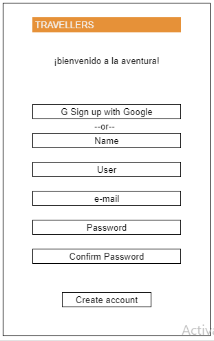
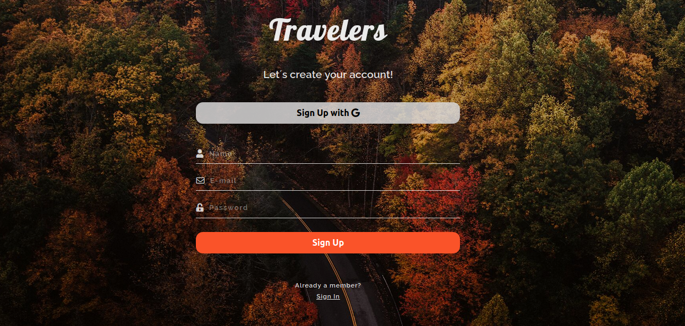

[Fuente Laboratoria](https://github.com/Laboratoria/LIM014-social-network)

***
# TRAVELERS SOCIAL NETWORK

## Índice

* [1. Definición del Producto](#1-definicion-del-producto)
* [2. Diseño de wireframes del proyecto](#2-wireframe-del-proyecto)
* [3. MVP](#3-MVP)

## 1. Definición del Producto
El proyecto Travelers Social Network es **una red social donde nuestros usuarios podrán compartir sus experiencias obtenidas en distintos lugares del mundo, como también podrán contactar con otros usuarios con el mismo interés.** También podrán visualizar y compartir post con imágenes, bitácoras, plan de viajes, presupuestos, reseñas, y mucho más.

Nuestros principales usuarios son los millenials entre 20 y 40 años, hombres y mujeres entre ellos turistas drifters, exploradores, aficionados, amantes del arte, y mucho más.

Nuestros usuarios utilizarán nuestro producto cuando quieran emprender un nuevo viaje y necesiten reseñas o tips de alún lugar en específico, cuando quieran contactar a un/a viajer/a directamente, cuando simplemente quiera ver que hay de nuevo en la red social o cuando quieras deleitarse con lugares maravillosos para viajar.

## 2. Diseño de wireframes del proyecto

* Home page

* Sign up

* Login

* Timeline

## 3. MVP

**Mobile**

**Desktop**

